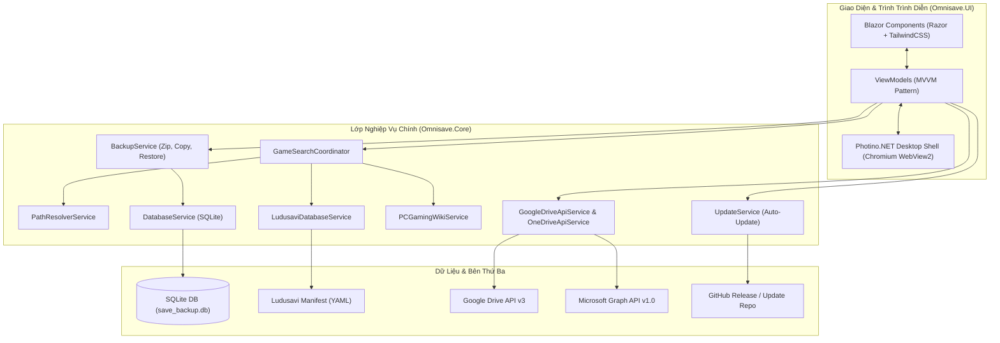

# 🛡️ Omnisave - Game Save Manager & Cloud Vault

<div align="center">


**Giải pháp quản lý, sao lưu và đồng bộ save game đa nền tảng tối ưu nhất cho game thủ PC.**  
*Tự động phát hiện vị trí save của hơn 12.000+ tựa game, sao lưu 1-click, khôi phục tức thì và bảo vệ dữ liệu trên Google Drive & OneDrive.*

[Tính Năng](#-tính-năng-nổi-bật) • [Cài Đặt & Khởi Chạy](#-cài-đặt--khởi-chạy) • [Kiến Trúc](#-kiến-trúc--ngăn-xếp-công-nghệ) • [Hướng Dẫn Đám Mây](#-cấu-hình-đồng-bộ-đám-mây) • [Đóng Gói Phát Hành](#-đóng-gói--tạo-bản-phát-hành)

</div>

---

## 🌟 Tính Năng Nổi Bật

### 🎮 1. Tự Động Nhận Diện & Quét Save Game Thông Minh
- **Thư viện Offline Ludusavi (12.000+ game)**: Tích hợp sẵn cơ sở dữ liệu manifest khổng lồ, nhận diện tức thì các bom tấn (*Elden Ring, Cyberpunk 2077, Black Myth: Wukong, Baldur's Gate 3, Palworld, Monster Hunter, v.v.*) ngay cả khi không có kết nối Internet.
- **Tự động cập nhật Manifest**: Cơ chế tải ngầm manifest mới nhất từ GitHub định kỳ (15 ngày / 30 ngày) để luôn bắt kịp các tựa game mới ra mắt.
- **Tra cứu trực tuyến PCGamingWiki API**: Truy vấn MediaWiki / OpenSearch API theo thời gian thực nếu game không nằm trong thư viện có sẵn.
- **Bộ giải mã đường dẫn Windows thông minh (PathResolver)**: Tự động phân giải các biến môi trường `%APPDATA%`, `%LOCALAPPDATA%`, `%USERPROFILE%`, `Documents`, `Saved Games`, Registry Windows và thư mục Steam userdata (`<Steam-path>\userdata\<user-id>\<app-id>`).

### 💾 2. Sao Lưu 1-Click & Quản Lý Snapshot
- **Sao lưu nhanh**: 1-click để copy an toàn toàn bộ file save vào thư mục lưu trữ riêng biệt theo tên game.
- **Tạo Snapshot theo thời gian**: Hỗ trợ lưu nhiều mốc chơi theo dạng timestamp (`yyyy-MM-dd_HH-mm-ss`), cho phép quay lại bất kỳ thời điểm nào trước những quyết định quan trọng trong game.
- **Nén file ZIP tiết kiệm bộ nhớ**: Tùy chọn nén archive chuẩn giúp giảm tối đa dung lượng ổ cứng.
- **Atomic Backup**: Đảm bảo quá trình sao lưu diễn ra trọn vẹn, không để lại file rác nếu quá trình bị gián đoạn.

### 🔄 3. Khôi Phục Dữ Liệu Tức Thì (1-Click Restore)
- Khôi phục chính xác các file save từ bản sao lưu (cả dạng thư mục lẫn file ZIP) ngược trở về thư mục save gốc của game.
- Tính năng bảo vệ: Tự động tạo bản sao lưu an toàn trước khi ghi đè dữ liệu cũ.

### ☁️ 4. Đồng Bộ Đám Mây Độc Lập (Google Drive & OneDrive)
- **Chuẩn OAuth 2.0 PKCE bảo mật**: Đăng nhập trực tiếp qua trình duyệt mặc định của hệ thống, không lưu mật khẩu người dùng.
- **Không cần cài đặt Client**: Tương tác trực tiếp qua REST API (Google Drive v3 API & Microsoft Graph v1.0), không cần cài Google Drive hoặc OneDrive trên máy tính.
- **Theo dõi tiến trình upload/download**: Hiển thị tốc độ tải, số byte đã gửi và trạng thái đồng bộ rõ ràng.

### 🎨 5. Giao Diện Dark Glassmorphism Hiện Đại
- Được xây dựng bằng **Photino.Blazor** kết hợp **TailwindCSS**: Tiêu tốn cực ít RAM (~35 - 50 MB RAM, nhẹ hơn rất nhiều so với Electron ~300MB+).
- Hiệu ứng kính mờ (Glassmorphism), dải màu tương phản cao, chuyển động vi mô (micro-interactions) mượt mà 60 FPS.
- Đầy đủ tính năng: Tìm kiếm game nhanh, gợi ý tự động, xem trước ảnh bìa (Cover Image), mở nhanh thư mục trong Windows Explorer.

### 🚀 6. Hệ Thống Tự Động Cập Nhật (Auto-Update)
- Tự động kiểm tra phiên bản mới từ GitHub Releases.
- Tải ngầm bản cập nhật với thanh tiến trình real-time (tốc độ MB/s, phần trăm hoàn thành thực tế).
- **Kiểm tra an toàn toàn diện**: Kiểm tra dung lượng đĩa khả dụng (> 200 MB), xác thực tính toàn vẹn file nén, xử lý ngắt kết nối mạng với banner thông báo lỗi và nút "Thử Tải Lại".
- Tự động thay thế tệp và khởi động lại Omnisave thông qua kịch bản runner script an toàn.

---

## 🏗 Kiến Trúc & Ngăn Xếp Công Nghệ



### ⚙️ Danh Sách Công Nghệ
| Thành phần | Công nghệ sử dụng | Mục đích |
| :--- | :--- | :--- |
| **Runtime & Ngôn ngữ** | .NET 10.0 / C# 14 | Hiệu năng cao nhất, cú pháp hiện đại, tối ưu AOT/ReadyToRun |
| **Giao diện Desktop** | Photino.Blazor / Photino.NET | Giao diện web desktop siêu nhẹ, dung lượng bộ nhớ RAM tối thiểu |
| **Styling & Hiệu ứng** | TailwindCSS + Vanilla CSS | Giao diện Dark Glassmorphism bóng bẩy, hiện đại |
| **Cơ sở dữ liệu** | Microsoft.Data.Sqlite | Lưu trữ lịch sử sao lưu, cấu hình cài đặt và cache tìm kiếm |
| **Dữ liệu Game** | Ludusavi Manifest YAML + PCGamingWiki API | Nhận diện vị trí file save của hơn 12.000+ tựa game |
| **Đám mây** | REST API + OAuth 2.0 PKCE | Đồng bộ Google Drive và OneDrive an toàn, tiện lợi |
| **Bộ nén & giải nén** | System.IO.Compression | Đóng gói ZIP và khôi phục nhanh chóng |

---

## 📁 Cấu Trúc Dự Án

```text
Omnisave/
├── Omnisave.slnx              # Solution file định dạng XML mới của .NET 10
├── version.json                     # Single Source of Truth cho toàn bộ phiên bản
├── Directory.Build.props            # Tự động đồng bộ version.json vào Assembly metadata
├── CHANGELOG.md                     # Lịch sử chi tiết các phiên bản phát hành
├── changelogs.json                  # Dữ liệu JSON changelog dùng trong ứng dụng
├── LaunchApp.bat                    # Script khởi chạy ứng dụng tức thì 1-click
├── build_exe.ps1                    # Script tự động build, tạo launcher và đóng gói ZIP
├── build_exe.bat                    # Batch wrapper chạy build_exe.ps1
│
├── Omnisave.Core/             # [Core Logic Project]
│   ├── Models/                      # GameSaveInfo, BackupRecord, AppSettings, Config
│   └── Services/                    # Toàn bộ business logic & API clients
│       ├── BackupService.cs         # Xử lý sao lưu, nén ZIP, khôi phục dữ liệu
│       ├── DatabaseService.cs       # Truy vấn SQLite (save_backup.db)
│       ├── PathResolverService.cs   # Phân giải đường dẫn Windows, Steam, môi trường
│       ├── GameSearchCoordinator.cs # Phối hợp tìm kiếm giữa Cache, Ludusavi & Wiki
│       ├── LudusaviDatabaseService.cs # Đọc & cập nhật cơ sở dữ liệu manifest YAML
│       ├── PCGamingWikiService.cs   # Tra cứu vị trí save qua PCGamingWiki
│       ├── UpdateService.cs         # Kiểm tra, tải và thực thi tự động cập nhật
│       └── Cloud/                   # GoogleDriveApiService, OneDriveApiService, OAuth
│
├── Omnisave.UI/               # [Desktop Application UI]
│   ├── Components/                  # Blazor Razor Components
│   │   ├── Pages/                   # HomeTab, HistoryTab, SettingsTab
│   │   ├── Shared/                  # Navigation, Modals, UpdateModal
│   │   └── Routes.razor
│   ├── ViewModels/                  # MVVM ViewModels cho từng màn hình
│   │   ├── MainViewModel.cs         # ViewModel trung tâm
│   │   ├── HomeSubViewModel.cs      # Tìm kiếm, danh sách game, thao tác backup
│   │   ├── HistorySubViewModel.cs   # Quản lý lịch sử, snapshot, restore
│   │   ├── SettingsSubViewModel.cs  # Cài đặt thư mục, tùy chọn hệ thống
│   │   ├── CloudSubViewModel.cs     # Đăng nhập & quản lý Google Drive / OneDrive
│   │   └── UpdateSubViewModel.cs    # Quản lý tiến trình cập nhật ứng dụng
│   ├── wwwroot/                     # CSS, JS, Fonts, Tailwind output
│   └── Program.cs                   # Điểm khởi đầu ứng dụng Photino.Blazor
│
├── Omnisave.Launcher/         # [Launcher Wrapper]
│   └── Launcher khởi động ứng dụng độc lập không phụ thuộc console
│
├── Omnisave.Tests/            # [Automated Test Suite]
│   └── Program.cs                   # 33+ bài kiểm thử tích hợp (End-to-End Core Tests)
│
└── data/                            # [DUY NHẤT] Toàn bộ dữ liệu của ứng dụng (Chuẩn Portable)
    ├── backups/                     # [CỐ ĐỊNH] Nơi lưu trữ tất cả các bản sao lưu
    ├── config/                      # appconfig.json (Cấu hình UI & Token mã hóa AES-256)
    ├── covers/                      # Ảnh bìa game
    ├── database/                    # [CỐ ĐỊNH] save_backup.db & manifest.yaml
    ├── logs/                        # Nhật ký hoạt động hàng tháng (JSON)
    ├── reverts/                     # Điểm hoàn tác an toàn trước khi khôi phục
    └── temp/                        # Thư mục tạm & thư mục con auto_update/
```

---

## 💻 Cài Đặt & Khởi Chạy

### Yêu Cầu Hệ Thống
- Hệ điều hành: **Windows 10 / Windows 11 (64-bit)**.
- Đã cài đặt **.NET 10.0 SDK** (nếu chạy từ mã nguồn).
- Microsoft Edge WebView2 Runtime (đã có sẵn trên hầu hết các máy Windows 10/11).

### 1. Khởi Chạy Nhanh (Dành cho nhà phát triển)
Chỉ cần nhấp đúp chuột vào file:
```cmd
LaunchApp.bat
```
Hoặc chạy lệnh từ terminal:
```bash
dotnet run --project Omnisave.UI/Omnisave.UI.csproj
```

### 2. Chạy Bộ Kiểm Thử Tự Động (Integration Tests)
Omnisave đi kèm bộ test tích hợp kiểm tra toàn bộ luồng nghiệp vụ (Phân giải đường dẫn, SQLite, Backup, ZIP, Khôi phục, Đám mây, Auto-Update):
```bash
dotnet run --project Omnisave.Tests/Omnisave.Tests.csproj
```

---

## ☁️ Cấu Hình Đồng Bộ Đám Mây

Omnisave hỗ trợ đồng bộ dữ liệu đám mây độc lập thông qua giao thức **OAuth 2.0 PKCE** an toàn:

### 1. Google Drive
1. Truy cập [Google Cloud Console](https://console.cloud.google.com/).
2. Tạo một dự án mới và bật **Google Drive API**.
3. Cấu hình **OAuth consent screen** (Loại: External, thêm scope `.../auth/drive.file`).
4. Tạo **OAuth 2.0 Client ID** (Loại ứng dụng: **Desktop App**).
5. Mở tab **Cài Đặt > Đồng Bộ Đám Mây** trong Omnisave, điền **Client ID** (và Client Secret nếu có) rồi bấm **"Kết Nối Google Drive"**.
6. Trình duyệt sẽ mở trang xác thực của Google để bạn cấp quyền trong 1-click.

> 📖 *Xem hướng dẫn chi tiết kèm hình ảnh minh họa tại [GOOGLE_DRIVE_SETUP_GUIDE.md](file:///c:/Users/TuanNguyen/Desktop/New%20folder%20%289%29/Omnisave/GOOGLE_DRIVE_SETUP_GUIDE.md).*

### 2. Microsoft OneDrive
1. Truy cập [Microsoft Entra / Azure Portal](https://portal.azure.com/).
2. Đăng ký ứng dụng mới với quyền truy cập tài khoản cá nhân.
3. Thêm quyền API: `Files.ReadWrite` và `offline_access`.
4. Điền **Client ID** vào Omnisave và tiến hành kết nối an toàn.

---

## 📦 Đóng Gói & Tạo Bản Phát Hành

Dự án cung cấp kịch bản tự động hóa hoàn toàn quy trình đóng gói ứng dụng:

```powershell
# Chạy script đóng gói tự động
.\build_exe.ps1
```
Hoặc nhấp đúp file:
```cmd
build_exe.bat
```

**Quy trình tự động thực hiện:**
1. Đọc phiên bản từ `version.json`.
2. Biên dịch Self-Contained `.NET 10` cho Windows x64 (SingleFile/ReadyToRun).
3. Biên dịch Launcher độc lập `Omnisave.exe`.
4. Tự động tích lũy lịch sử phát hành vào `changelogs.json` và sinh `CHANGELOG.md`.
5. Đóng gói toàn bộ sản phẩm thành file `publish.zip` sẵn sàng phân phối cho người dùng cuối.

---

## 📄 Bản Quyền & Giấy Phép

Phát triển bởi **Tuan Nguyen** © 2026. Mọi quyền được bảo lưu.  
Ứng dụng được xây dựng phục vụ cộng đồng game thủ với tiêu chí: **An toàn - Nhẹ - Nhanh - Tiện lợi**.
